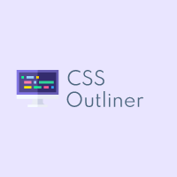

### Coming Soon...

     
    <a href="#" style="text-decoration: none">
        
         
        <h1 align="center" style="color: #ffffff">Css Outliner</h1>
    </a>

<h4 align="center">
    Adding outline for chosen <b>HTML</b> tag and many other tools for <b>CSS3</b>
</h4>
 

    
    
    
    

    <a href="#features-art">Key Features</a> •
    <a href="#download-open_file_folder">Download</a> •
    <a href="#changelog-hammer_and_pick">Changelog</a> •
    <a href="#appearance-framed_picture">Appearance</a> •
    <a href="#support-call_me_hand">Support</a> •
    <a href="#license-book">License</a>

 

## Features :art:

    
<h3>Get CSS Properties from any element by just hovering or selecting it</h3>

    

    
<h3>Download website assets</h3>

    

    
<h3>Get the color palette of the website</h3>

    

    
<h3>Customizable settings</h3>

    <ul>
        <li>
            <a href="#shortcuts"><h4>Keyboard Shortcuts</h4></a>
            
Yes, you can add custom shortcuts! Actually change the existing ones. The extension provide some shortcuts by default, but you can customize them how you want.

        </li>
        <li>
            <a href="#active-instruments"><h4>Active instruments</h4></a>
        </li>
    </ul>

    
<h3>Keyboard Shortcuts</h3>

    <ul>
        These are default shortcuts:
        <li><code>Esc</code> to exit the app</li>
        <li><code>f</code> to freeze the window</li>
        <li><code>s</code> stop/cancel work and back to the main page</li>
        <li><code>o</code> copy css</li>
        <li><code>g</code> display outline</li>
        <li><code>b</code> display background</li>
        <li><code>Ctrl</code> + <code>←</code> or <code>→</code> to move the extensios</li>
    </ul>

    
<h3>Active instruments on your list of pages without opening the extension every time</h3>

    
Coming soon..

    
<h3>Empty one</h3>

    <ul>
        <li></li>
    </ul>

 

## Download :open_file_folder:

    
Here are the links where you can download and use the extension!

    <ul>
        <li><a href="">Chrome</a></li>
        <li><a href="">Firefox</a></li>
        <li><a href="">Opera</a></li>
        <li><a href="">Safari</a></li>
    </ul>

 

## Changelog :hammer_and_pick:

    
<h3>Version 1.0.0 The Beginning :orthodox_cross:</h3>

    

        Lorem ipsum dolor sit amet, consectetur adipiscing elit. Proin ac ipsum sodales, dapibus libero id, commodo dui. Donec faucibus ultrices sollicitudin. Cras sapien metus, consequat ut ex at, tempor accumsan augue. Morbi at maximus mauris. Nam maximus iaculis quam at scelerisque. Donec turpis massa, tristique at urna non, pharetra iaculis mauris.
        <ul>
            <li>asdas</li>
            <li>sdas</li>
            <li>asdas</li>
            <li>dsad</li>
            <li>sadas</li>
            <li>sadas</li>
        </ul>
    

  

## Appearance :framed_picture:

• inspired
from [4ebur.net – Best VPN Proxy](https://chrome.google.com/webstore/detail/4eburnet-%E2%80%93-best-vpn-proxy/bpoljniljbghlopcdaojdpodmnjffdeb)

 

## Support :call_me_hand:

    • Chrome &nbsp;  

    • Firefox &nbsp;  &nbsp; Coming soon..  

    • Edge &nbsp;  &nbsp; Coming soon..  

    • Opera &nbsp;  &nbsp; Coming soon..  

  

## Licence :book:

MIT &copy; [Van4kk](https://github.com/Van4kk/)

    Give a :star: to the extension if you liked it.  
    Made with :heart: by <a href="https://github.com/Van4kk/">Van4kk</a>

